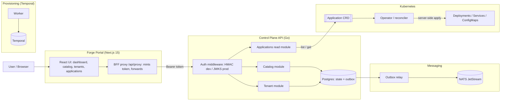

# Forge Architecture

Forge is an internal developer platform: a control plane that lets teams register
services, manage tenants, and run workloads, with a web portal over the top. This
document describes how the pieces fit together and the deliberate decisions
behind them.

## System overview

## Components

The control plane API is a Go service exposing a versioned REST API under
`/api/v1`, split into bounded-context modules. Catalog manages service records
(lifecycle, ownership, tier) and tenants manages tenant records (status, quota).
Both persist to Postgres and use optimistic concurrency: every write requires an
`If-Match` version and every create accepts an `Idempotency-Key`. The
applications module is read-only and projects Kubernetes state (see below).

Domain events are published through the transactional outbox pattern: a write and
its event land in the same Postgres transaction, and a separate relay process
forwards outbox rows to NATS JetStream. This decouples the write path from
downstream consumers and survives crashes without losing or double-firing events.

The operator is a Kubernetes controller that reconciles an `Application` custom
resource into a Deployment, an optional Service, and an observability ConfigMap.
It applies desired state with Kubernetes server-side apply, which makes reconciles
idempotent (an unchanged Application is a no-op) and corrects drift: a manual
change to a managed Deployment is reverted on the next reconcile because the
Application is the source of truth. Admission policy (CEL validations on the CRD
plus Kyverno cluster policies) enforces guardrails such as no `:latest` images and
a replica floor for tier-1 apps.

Provisioning uses a Temporal workflow to run a durable, multi-step tenant
provisioning saga with compensation on failure. It runs out of band via a worker
and is triggered from the CLI.

The portal is a Next.js App Router application. The browser never holds a token:
it calls a backend-for-frontend proxy on the Next.js server, which mints a
short-lived token server-side and forwards to the control plane. This keeps
credentials off the client and avoids CORS. Data fetching, caching, optimistic
updates, and concurrency (`If-Match`) are handled with TanStack Query; responses
are validated with Zod.

## Key flows

A catalog write (for example, promoting a service to production) goes: portal
form to BFF proxy to control plane. The module validates the domain rule (an
on-call reference is required before production), writes the new state and a
domain event in one transaction, and returns the updated record with a new
version. The relay later forwards the event to NATS.

An application read goes: portal to BFF to the applications module, which lists
the `Application` custom resources from Kubernetes and returns each one's declared
spec alongside the live status the operator wrote back (phase, ready replicas,
conditions). It is read-only by design.

## Design decisions

Bounded-context modules keep catalog, tenant, and application logic independent,
each with its own domain, ports, adapters, and API, so they evolve without
coupling.

The transactional outbox was chosen over publishing to NATS inline because inline
publishing can lose events if the broker is unreachable after the DB commit, or
double-publish on retry. The outbox makes the event atomic with the state change.

Server-side apply replaced read-modify-write in the operator after observing
reconcile churn and status-update conflicts. Apply is idempotent and declarative,
which eliminated both.

The backend-for-frontend proxy was chosen over calling the API directly from the
browser so the auth token never reaches the client and there is no CORS surface
to manage. In production the dev-token step becomes an OIDC session.

Optional, non-fatal integrations: the applications endpoint degrades to 503 when
no cluster is configured, and the API runs fine without Kubernetes. This keeps the
control plane usable standalone and the portal graceful.

## Deliberate cuts

Provisioning is not yet exposed over HTTP, so the portal does not show workflow
runs; surfacing it needs a Temporal-backed read endpoint. Cross-module quota
enforcement (tenant quota limiting catalog writes) is modeled but not wired across
modules. Provisioning backends are simulated rather than integrating real
infrastructure providers. These are scoping choices made to keep the platform
coherent and demonstrable rather than exhaustive.
